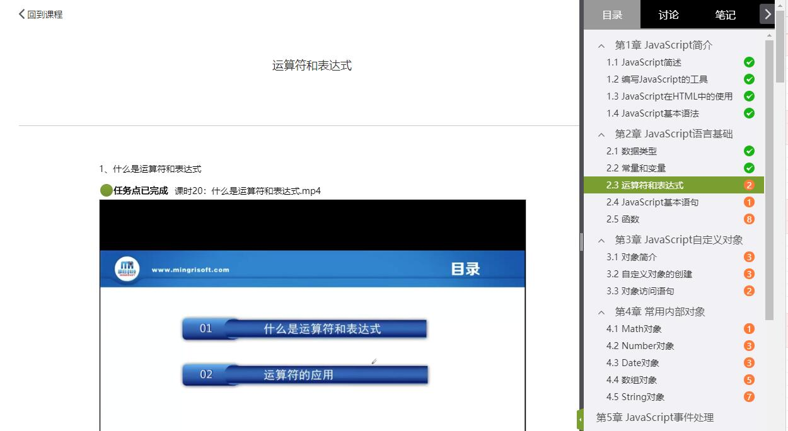
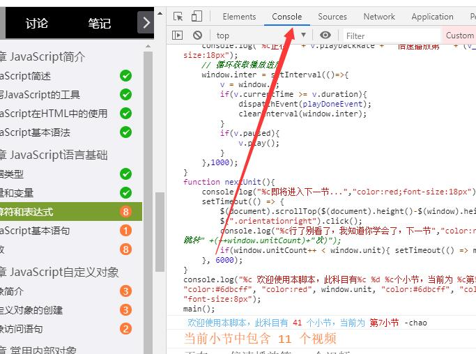

# 学习通自动刷课脚本
此为学习通自动刷课脚本，使用方法简单，可以刷科目里的任务点

### 使用方法

打开浏览器，进入网页版的学习通科目页面

在进入学习界面时，按键盘上的`F12`键，然后进入`Console`选项卡，选择要继续学习的那一节，将代码粘贴进去，然后回车即可。

使用时，尽量不要挂在后台，因为在加载下一个视频的时候，浏览器会自动休眠，导致暂停；
如果挂载后台暂停了，将浏览器窗口至于前台则会继续。

### 注意事项

- 如遇到脚本出错，请先刷新页面后再次使用。
- 默认播放速度为8倍，可以修改代码`v.playbackRate = 8; `这个值来修改速度，如果电脑配置较低，请降低倍率。